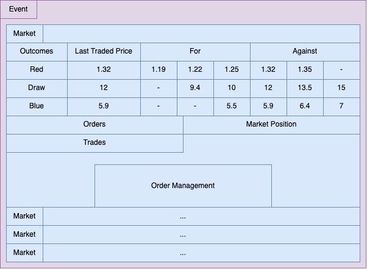
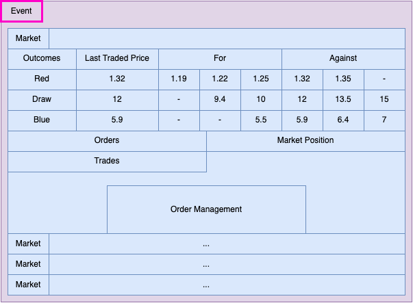
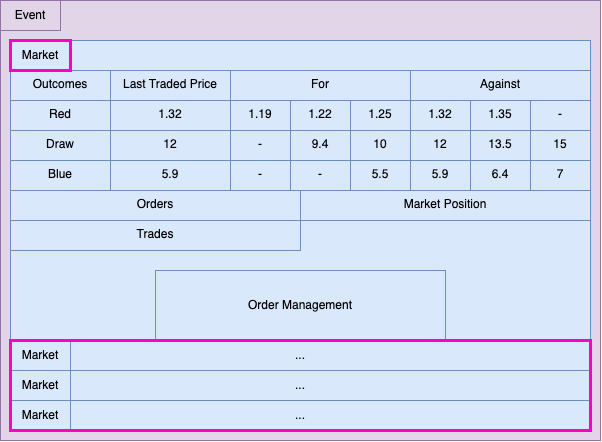
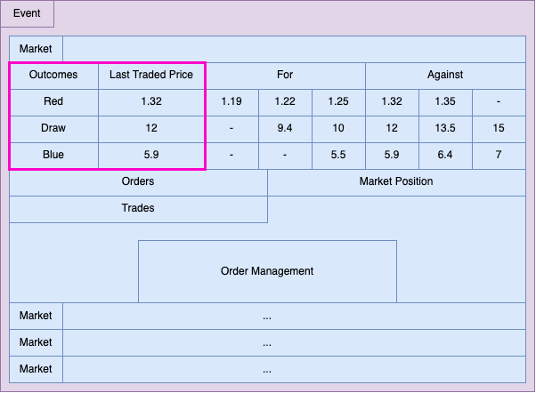
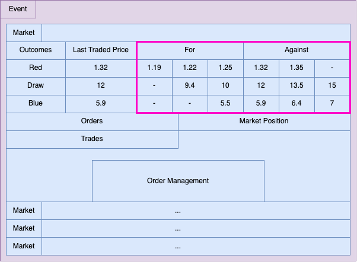
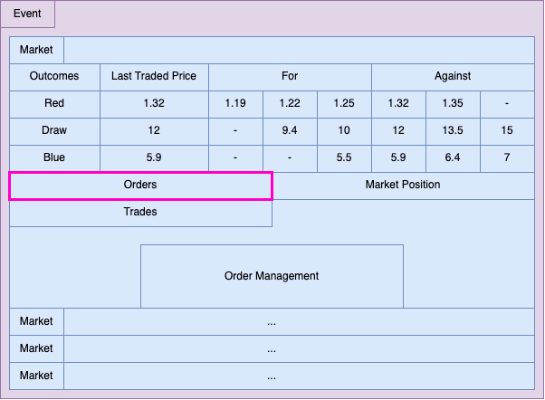
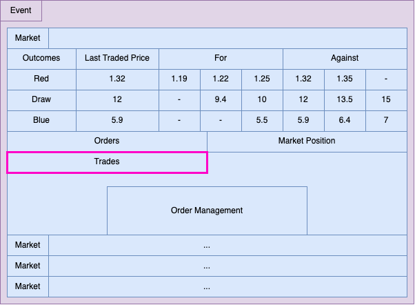
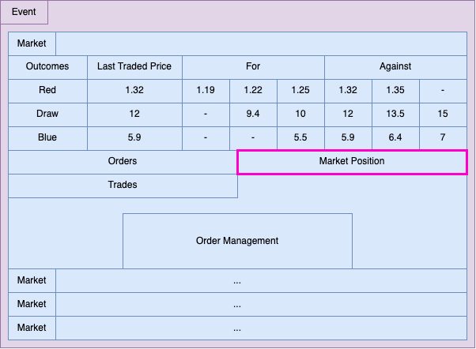
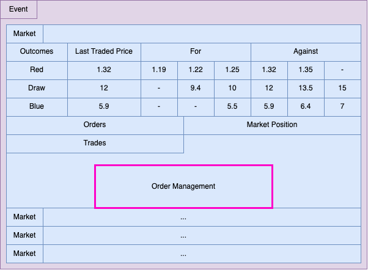

# Anatomy of an Exchange

This document breaks down a typical exchange, what endpoints are used for each section, and the primary information displayed based on the response of that endpoint.
# Event

**Endpoint**: Pending ([BetDEX API](https://prod.events.api.betdex.com/events) for now)

The thing on which the results of, or stats from, determine the outcome of the markets associated with it. For example:

- Category: Esports
- Sub Category: PvP
- EventGroup: Halo
- Title: Red vs Blue
- Participants: Red, Blue
- Event Start: 21st September 2050 09:00 UTC
- Event Estimated End: 21st September 2025 11:00 UTC

# Market

**Endpoint**: [GetMarket](https://github.com/MonacoProtocol/protocol/blob/develop/npm-client/docs/endpoints/markets.md#getmarket) | 
[GetMarketAccountsByStatus](https://github.com/MonacoProtocol/protocol/blob/develop/npm-client/docs/endpoints/market_query.md#getmarketaccountsbystatus)

An event can have multiple markets (for example, result, first team to score a point, over and under a certain amount of points.

Markets can be set to lock during the event, or to stay open as an `inplay` market.

- Market: `<publicKey of Market Account>`
- Market Type: Result
- Status: Open
- Inplay Enabled: True
- Inplay: True
- Inplay Order Delay: 3
- Number of Outcomes: 3
- Event Start: 21st September 2050 09:00 UTC
- Market lock time: 21st September 2025 11:00 UTC
- Suspended: false
- Published: true
- Event Start Order Behaviour: cancel unmatched

Markets contain a published flag so that operators can make use of this as a `pseudo-cms`, only displaying onchain markets for entries that are published; though any market can be entered that isn’t suspended or past its lock time.

You will also notice, `event start order behaviour`, this is specifically for `inplay` markets so that the market state is wiped clean as the event begins, allowing for a fairer experience. They also include an `inplay order delay` this represents the number of seconds that need to elapse before an order can be matched (whilst the market is in an `inplay` state)

# Market Outcomes

**Endpoint**: [GetMarketOutcomesByMarket](https://github.com/MonacoProtocol/protocol/blob/develop/npm-client/docs/endpoints/market_outcome_query.md#getmarketoutcomesbymarket)

There is a market outcome account for each outcome on a market, for example, one for Red, one for Draw, and one for Blue. The key information here is the title, the human-readable field of the outcome and the index for the outcome. The protocol needs the index for entry and the person placing the order needs to know the title for context.

- Index: 0
- Title: Red
- Latest Matched Price: 1.32
- Matched Total: 213,63
- Price Ladder: Prices (odds) order can be placed at - usually the [DEFAULT_PRICE_LADDER](https://github.com/MonacoProtocol/protocol/blob/7c7e32f083bd787040bd398f5290dd6a42f7eac8/npm-admin-client/types/default_price_ladder.ts#L4)

To help inform the user of the current market condition with matched total and last matched price also included.

# Price Matrix

Endpoint: [GetAllMarketMatchingPools](https://github.com/MonacoProtocol/protocol/blob/develop/npm-client/docs/endpoints/market_matching_pools.md#getallmarketmatchingpools)

A price matrix can be constructed with the data returned from the market matching pools. Market matching pools exist for all placed order combinations on the market. Order combinations are made up of:

- Outcome index
- For/Against the outcome
- Price

Using these matching pools you can highlight to users what prices are currently the most favourable in terms of liquidity. 

- Market Outcome Index: 2
- For outcome: false
- Price: 5.9
- Liquidity: 815
- Matched amount: 185

To form a price matrix you need to:

- Get the market matching pools
- Group based on outcome
- Group based on for/against the outcome
- Order based on price and liquidity available

Industry standard then tends to show:

- On the left hand side of the matrix, the top 3 prices (descending from right to left) opposing the outcome
- This shows users what prices are available should they wish to place an order for the outcome
- On the right hand side of the matrix, the top 3 prices (ascending form left to right) backing the outcome
- This shows the users what prices are available should they wish to place an order against the outcome

This piece of the exchange requires the most mapping but does offer user an enhanced experience as it shows them a truer state of the market to help inform their decision.

The endpoint [GetMarketPrices](https://github.com/MonacoProtocol/protocol/blob/develop/npm-client/docs/endpoints/market_prices.md#getmarketprices) can also provide this information but it also fetched pending orders and as such can be quite an intensive request as a market scales.

# Orders

**Endpoint**: [GetOrdersByMarketForWalletProvider](https://github.com/MonacoProtocol/protocol/blob/develop/npm-client/docs/endpoints/order_query.md#getordersbymarketforproviderwallet) | 
[OrderQuery](https://github.com/MonacoProtocol/protocol/blob/develop/npm-client/docs/endpoints/order_query.md#orders)

Depending on how you set up your exchange you may only wish to show orders for the connected wallet (ForWalletProvider) or all orders on a market (OrderQuery) which can also be filtered by status and purchaser.

- Market Account Public Key: `<publicKey>`
- Market Outcome Index: 0
- For Outcome: true
- Order Status: matched
- Stake: 150
- Voided stake: 0
- Stake Unmatched: 0
- Expected Price: 2
- Payout: 300
- Product: Your Exchange
- Product Commission Rate: 0.1
- Creation Timestamp: 1693812205

Order accounts contain all the information a user requires to understand the current state of their order including how much commission rate is for the product they entered via (commission is only charged for winning orders). Most importantly is the public key that allows the user to cancel any unmatched portion of their order (see order management below).

# Trades

**Endpoint**: [GetTradesForMarket](https://github.com/MonacoProtocol/protocol/blob/develop/npm-client/docs/endpoints/trade_query.md#gettradesformarket)

When orders are matched (either fully or partially) trades are created that show us at what rate the match occurred. There’s a trade account for each side of a trade.

- Purchaser: `<publicKey of Wallet Owning Order>`
- Order: `<publicKey of Order>`
- Opposite trade `<publicKey of the Opposite Trade>`
- Market Outcome Index: 0
- For Outcome: False
- Stake: 150
- Price: 2
- Creation Timestamp: 1693812205

Trades can help display to users the current active state of the market. Whilst orders can show you where people want the market to be, trades can show them where it is as they indicate matched orders.

# Market Position

**Endpoint**: [GetMarketPosition](https://github.com/MonacoProtocol/protocol/blob/develop/npm-client/docs/endpoints/market_position.md#getmarketposition)

Market position informs the user of their matched exposure on a market, or to put it more simply - how much they stand to win or lose on the outcomes.

- Market Outcome Sums: A list of numbers that map 1:1 with the outcomes for example:
  -  Sums of [100, -100, -100]
  -  Mean that if outcome 0 is successful, the user will get 100 in returns
  -  However, if outcome 1 or 2 is successful, they will lose 100 

# Order Management

## Place Order

**Endpoint**: [CreateOrderUiStake](https://github.com/MonacoProtocol/protocol/blob/develop/npm-client/docs/endpoints/create_order.md#createorderuistake)

This is a write request to the chain, allowing for the connected wallet to place an order (bet).

- Market: `<publicKey of the Market>`
- Market Outcome Index: Either 0, 1, 2 representing [Red, Draw, Blue]
- For Outcome: true/false
- Price: Odds for bet based on price ladder on outcome
- Stake: The direct UI value of the bet (20 means $20)
- Product: `<publicKey of the Product (your exchange) they are entering via>` (can be null for commission free)

The primary things to note here are:

- You need to pass the index of the outcome not the index title
- When an against order (forOutcome: false) the stake is not the value that will be taken from the user, the value would be the calculated risk:
  - Stake * Odds - Stake = Risk 
  - Stake 10, Odds 1.5, Risk = 5
  - Stake 10, Odds 7.0, Risk = 60

The return value of the request contains:

- The publicKey of the order account (should the transaction succeed)
- The transaction ID (signature) of the request

## Cancel Order(s)

**Endpoint**: [CancelOrder](https://github.com/MonacoProtocol/protocol/blob/develop/npm-client/docs/endpoints/cancel_order.md#cancelorder) | 
[CancelOrdersForMarket](https://github.com/MonacoProtocol/protocol/blob/develop/npm-client/docs/endpoints/cancel_order.md#cancelordersformarket)

This allows the user (the connected wallet) to either cancel a specific order based on the order account publicKey, or cancel all the orders they can cancel for the provided market publicKey.

The return value of the request contains:

- The transaction ID (signature) of the request
- Any failed order publicKeys if using cancel by market
