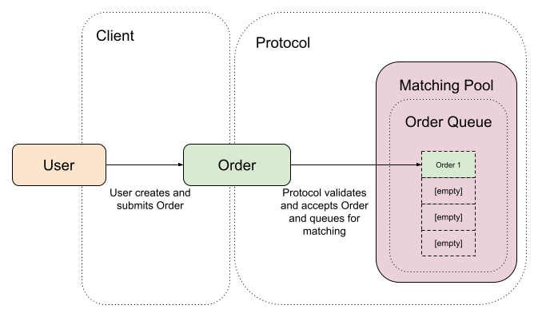
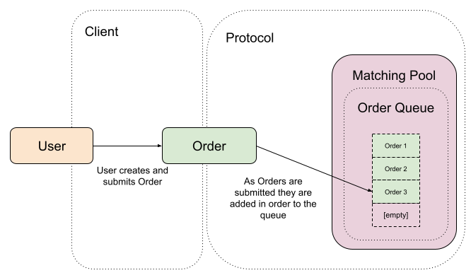
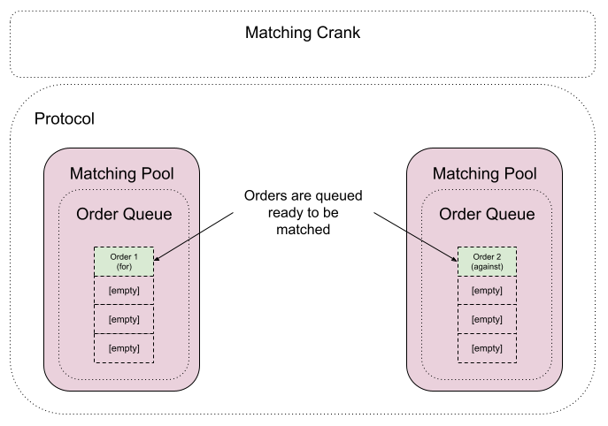
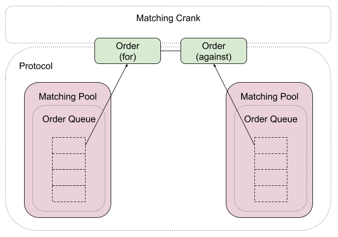

# Order Creation

An order contains:

- The market.
- The predicted outcome index.
- The prediction - `FOR/AGAINST` the outcome occurring.
- The price.
- The stake.

This is then authorized and owned by the signing wallet. Once done so, an order is placed into a matching pool queue for matching.

Each outcome on a market:

- Has an associated market outcome account.
  - This holds the prices for the outcome (probabilities).
  - Only assigned prices can be used by an order for that outcome.

When an order is created:

- An order account will be created
- The order will have the status of `unmatched`
- If a matching pool for the order criteria doesn't exist one will be created.
  - Matching pools exist based on the outcome, price, and for/against that outcome.
  - They track orders and liquidity at this specific price point
- Once created, the order account key is added to the matching queue on that pool.
- Subsequent orders with the same order criteria are placed on the end of the queue.

Once the wallet creates the new Order and submits it to the Monaco protocol it will be added to the correct MatchingPool queue, awaiting the matching process.

As new Orders are submitted the queue within the MatchingPool fills up, holding all the unmatched Orders.

# Cancellation

- Any unmatched or partially matched order can be cancelled by the order authority (purchasing wallet)
- If partially matched then only the unmatched portion will be cancelled
- Orders are removed from their relevant matching pool when cancelled

# Exposure

The protocol manages exposure and will continually update a wallet position during order creation and matching.

- Transferred funds and predictions are tracked per wallet, per market.
  - This allows the protocol to calculate the position of a wallet on a given market.
  - The position includes potential winnings and risk to calculate exposure.
- Using exposure the protocol can prevent the wallet from having to commit funds where their position may not require it.

Example:

> On a market where an event would either occur or not occur, if a wallet was to transfer funds to predict an event would occur, that same wallet don't need to transfer funds to also predict the event will not occur (assuming the same probability and risk amount) - in this case either the event occurs or it doesn't and the initial risk amount can cover both orders.

The principle behind the exposure calculation is to always ensure there is enough locked funds from the wallet to cover the largest payout at any given time. Both the risk amount and probabilities are used to calculate the payout if the prediction is deemed a winner and by using the payout amount as the max exposure value allows the protocol to accept an opposite prediction up to the value of the calculated exposure.

# Matching

- Matching process is responsible for recognizing opposing liquidity on an outcome.
  - Opposing liquidity is created when there are a minimum of two orders that directly oppose each other.
  - Opposing liquidity can come from unmatched or partially matched orders.
- When there isn’t an exact opposing match, orders can be partially matched with orders that hold a smaller risk amount.
  - This allows greater flexibility in the matching process.
  - The amount of unmatched liquidity is always matched on an order to allow for matching as more opposing liquidity enters the market.
- Orders remain on the matching queues until fully matched.
  - They can never be matched to more than their original value.

Example:

> If there is both a prediction ‘for’ an outcome and a prediction ‘against’ the same outcome at the same probability and risk amount, these predictions can be matched as each prediction will cover the other in the event either wins. The matching process will take these Order accounts, set them as “matched” and update the available liquidity amounts on the Matching Pool account(s) to keep the values consistent.

## Process

Orders are selected from the queue:

The selected Orders are matched and removed from their respective queues:

